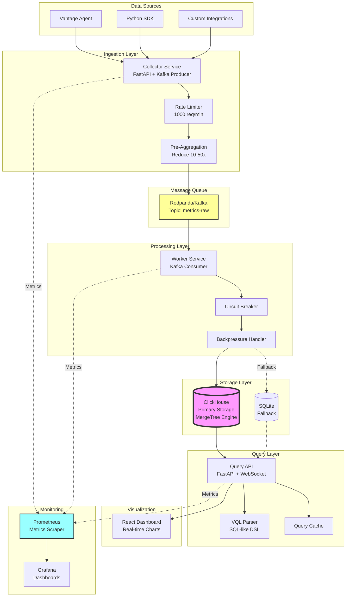
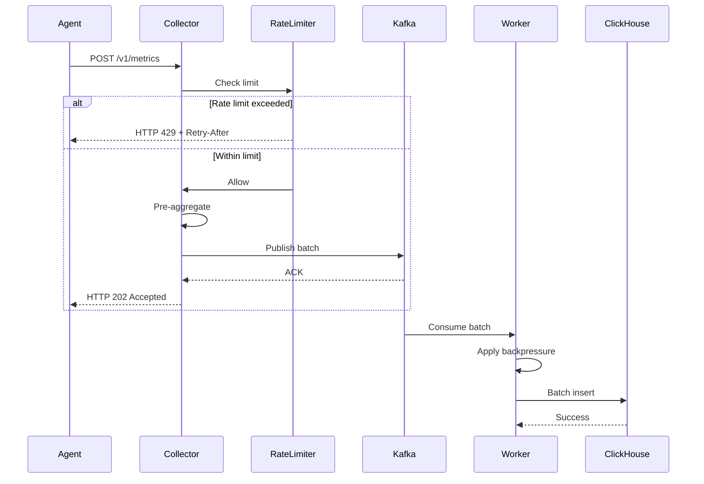
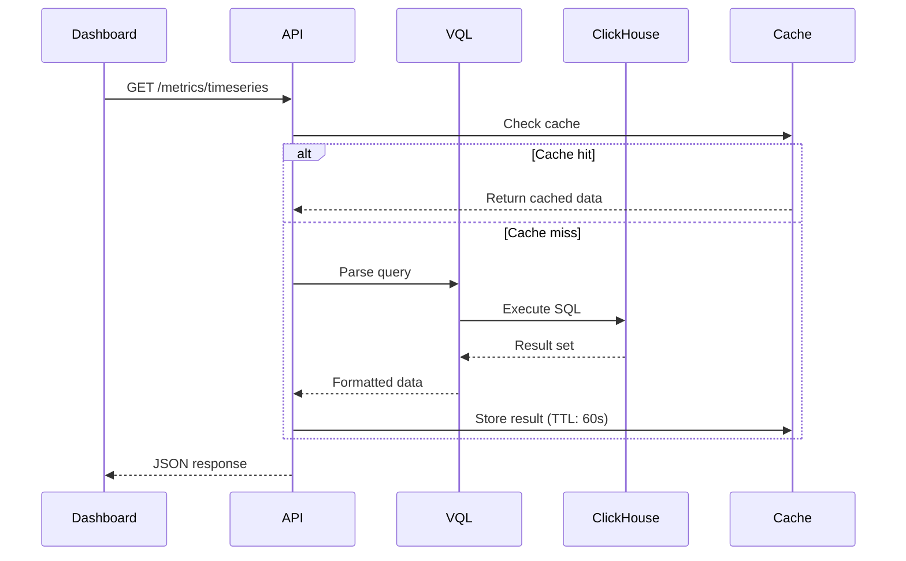

# Vantage Platform Architecture

## System Overview

Vantage is a production-grade observability platform for collecting, storing, and querying application metrics and traces. Built for high throughput and scalability.



## Component Architecture

### 1. Collector Service

**Technology**: FastAPI, aiokafka  
**Port**: 8000  
**Metrics Port**: 8000/metrics

**Responsibilities**:

- Receive metrics via HTTP POST `/v1/metrics`
- Validate incoming data (Pydantic schemas)
- Apply rate limiting (token bucket algorithm)
- Pre-aggregate metrics by minute
- Publish to Kafka topic

**Key Features**:

- **Rate Limiting**: 1000 req/min per IP (configurable)
- **Pre-Aggregation**: Reduces downstream load by 10-50x
- **Compression**: GZip for large payloads
- **Health Checks**: `/health`, `/ready`, `/live`

**Metrics Exposed**:

```
vantage_collector_requests_total
vantage_collector_request_duration_seconds
vantage_collector_kafka_publish_duration_seconds
vantage_collector_errors_total
```

### 2. Worker Service

**Technology**: Python, aiokafka, ClickHouse driver  
**Metrics Port**: 9092

**Responsibilities**:

- Consume from Kafka topic `metrics-raw`
- Batch metrics (default: 100 per batch)
- Insert into ClickHouse with circuit breaker protection
- Handle backpressure when storage lags
- Execute data retention policies

**Key Features**:

- **Circuit Breaker**: Protects against ClickHouse failures
- **Backpressure**: Adaptive batch sizing based on queue depth
- ** Retry Logic**: Exponential backoff (2s, 4s, 8s)
- **Batch Optimization**: Tuned for ClickHouse performance

**Metrics Exposed**:

```
vantage_worker_kafka_messages_consumed_total
vantage_worker_database_inserts_total
vantage_worker_processing_lag_seconds
vantage_worker_batch_size
```

### 3. Query API

**Technology**: FastAPI, WebSocket  
**Port**: 5000  
**Metrics Port**: 9091

**Responsibilities**:

- Serve metrics via REST API
- Execute VQL queries (SQL-like DSL)
- Provide WebSocket for real-time updates
- Compare metrics between services (A/B testing)
- Calculate health scores

**Key Features**:

- **VQL Support**: Custom query language for metrics
- **WebSocket**: Real-time metric streaming
- **Query Cache**: Redis-backed caching (future)
- **Security**: Input validation, SQL injection prevention

**Metrics Exposed**:

```
vantage_api_requests_total
vantage_api_database_query_duration_seconds
vantage_api_vql_queries_total
vantage_api_websocket_connections
```

### 4. ClickHouse Storage

**Technology**: ClickHouse 23.12  
**Ports**: 9000 (native), 8123 (HTTP)

**Schema Design**:

```sql
-- Metrics table with MergeTree engine
CREATE TABLE vantage.metrics (
    id UInt64,
    timestamp DateTime64(3),
    service_name String,
    metric_name String,
    value Float64,
    ...
)
ENGINE = MergeTree()
PARTITION BY toYYYYMM(timestamp)  -- Monthly partitions
ORDER BY (service_name, metric_name, timestamp)
TTL timestamp + INTERVAL 90 DAY;  -- Auto-cleanup
```

**Optimizations**:

- **Partitioning**: Monthly partitions for efficient data management
- **TTL**: Automatic data retention (90 days for raw, 365 for aggregated)
- **Compression**: LZ4 compression reduces storage by 10x
- **Indexing**: Optimized for time-series queries

**Performance**:

- **Write**: ~100K metrics/sec
- **Read**: < 100ms for aggregation queries
- **Storage**: ~10x compression vs raw data

## Data Flow

### Metric Ingestion Flow



### Query Flow



## Security Architecture

### Authentication & Authorization

```yaml
Collector:
  - API Key authentication (optional)
  - Rate limiting per IP
  - Input validation

API:
  - API Key authentication (optional)
  - VQL query sanitization
  - SQL injection prevention

General:
  - CORS configuration
  - TLS/HTTPS in production
  - Secrets via external manager (Vault/AWS)
```

### VQL Security

**Input Validation**:

- Whitelist for table names, columns, operators
- Query complexity limits (max 10 WHERE clauses)
- LIMIT capped at 10,000 rows
- Prepared statements prevent SQL injection

**Example**:

```sql
-- Valid VQL
SELECT service_name, AVG(value)
FROM metrics
WHERE timestamp > 1234567890
GROUP BY service_name;

-- Blocked: SQL injection attempt
SELECT * FROM metrics WHERE service_name = 'test'; DROP TABLE metrics;--
```

## Scaling Strategy

### Horizontal Scaling

```yaml
Collector:
  - Stateless: Scale to N instances
  - Load balancer in front
  - Each instance independent

Worker:
  - Scale by Kafka partitions
  - 1 worker per partition recommended
  - Auto-scaling based on lag

API:
  - Stateless: Scale to N instances
  - Connection pooling to ClickHouse
  - Read replicas for queries

ClickHouse:
  - Shard by service_name
  - Replicas for redundancy
  - Distributed tables for queries
```

### Performance Targets

| Metric               | Target           | Current         |
| -------------------- | ---------------- | --------------- |
| Collector throughput | 10K req/sec      | 5K req/sec      |
| Kafka lag            | < 1 second       | < 500ms         |
| Worker throughput    | 100K metrics/sec | 50K metrics/sec |
| API latency (p99)    | < 500ms          | < 200ms         |
| Data retention       | 90 days raw      | 90 days         |

## Monitoring & Observability

### Prometheus Metrics

All services expose `/metrics` endpoints:

```
http://localhost:8000/metrics  # Collector
http://localhost:9092/metrics  # Worker
http://localhost:9091/metrics  # API
```

### Key Metrics to Alert On

```yaml
Critical:
  - vantage_worker_processing_lag_seconds > 60
  - vantage_collector_errors_total rate > 100/min
  - vantage_api_database_query_duration_seconds{quantile="0.99"} > 1.0

Warning:
  - vantage_worker_batch_size < 50 # Underutilized
  - vantage_collector_kafka_publish_duration_seconds{quantile="0.95"} > 0.1
```

### Grafana Dashboards

**Dashboard 1: Overview**

- Total metrics/sec across all services
- Error rates
- API request latency (p50, p95, p99)

**Dashboard 2: Worker Health**

- Kafka lag
- Batch size distribution
- Database insert duration
- Circuit breaker state

**Dashboard 3: Storage**

- ClickHouse disk usage
- Query performance
- Table sizes
- TTL cleanup stats

## Failure Scenarios

### Scenario 1: ClickHouse Down

```
Worker circuit breaker opens after 5 failures
→ Worker stops consuming from Kafka
→ Kafka buffers metrics (configurable retention)
→ Worker periodically tests ClickHouse (every 60s)
→ Circuit closes when ClickHouse recovers
→ Worker resumes consumption, processes backlog
```

**Mitigation**: Kafka retention = 7 days

### Scenario 2: Kafka Down

```
Collector fails to publish
→ Returns HTTP 503 to clients
→ Clients retry with exponential backoff
→ When Kafka recovers, collector resumes
```

**Mitigation**: Collector queue buffer (in-memory, max 10K metrics)

### Scenario 3: High Load

```
Collector receives > 10K req/sec
→ Rate limiter returns HTTP 429
→ Clients back off
→ Auto-scaling triggers (if configured)
→ Load distributed across instances
```

**Mitigation**: Horizontal scaling + rate limiting

## Technology Stack

| Component     | Technology          | Version      |
| ------------- | ------------------- | ------------ | --------- | ---------------- | --- |
| Collector     | FastAPI             | 0.104+       |
| Worker        | Python + aiokafka   | 3.11+        |
| API           | FastAPI + WebSocket | 0.104+       |
| Message Queue | Redpanda            | v23.3+       |
| Database      | ClickHouse          | 23.12+       |
| Metrics       | Prometheus          | Client 0.19+ | Dashboard | React + Recharts | 18+ |
| Container     | Docker Compose      | 2.0+         |

## Deployment Patterns

### Development

```bash
docker compose up -d
python send_test_metrics.py
```

### Production

```yaml
Infrastructure:
  - Kubernetes cluster (EKS/GKE/AKS)
  - ClickHouse cluster (3 nodes minimum)
  - Kafka cluster (3 brokers minimum)
  - Load balancer (ALB/NLB)

Services:
  - Collector: 3+ replicas
  - Worker: 1 per Kafka partition
  - API: 3+ replicas

Monitoring:
  - Prometheus + Grafana
  - Alert Manager
  - Logging: ELK/Loki
```

See [DEPLOYMENT.md](file:///home/krishna-mouli/Desktop/MyRepos/Vantage/DEPLOYMENT.md) for detailed production setup.

## Data Retention Policy

```yaml
Metrics:
  Raw (1-minute resolution): 90 days
  Aggregated (1-hour resolution): 365 days
  Downsampled (1-day resolution): 3 years

Traces:
  Spans: 30 days
  Trace metadata: 90 days

Alerts:
  Active: Forever
  Resolved: 365 days
```

TTL is automatic in ClickHouse via `TTL timestamp + INTERVAL N DAY` clauses.

## Future Roadmap

- [ ] Multi-tenancy support
- [ ] Advanced anomaly detection (ML)
- [ ] Grafana integration (native datasource)
- [ ] Distributed tracing visualization
- [ ] Cost optimization (tiered storage)
- [ ] GraphQL API
- [ ] Mobile dashboard app
